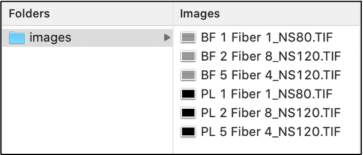

# An image-based analysis of recombinant silk fiber structures

The pipeline provided in this project performs segmentation and quantification of recombinant silk fibers using Fiji and it was implemented in ImageJ Macro Language. The input of the pipeline is a pair of images depicting a sample fiber from two microscopy techniques, brightfield (BF) and crossed polarizers (POM). The brightfield counterpart will be used for segmentation using Yen's threshold method, which yields a binary mask separating the fiber from the background. Next, a second segmentation is applied to the POM image restricted only to the fiber region. This is performed in order to characterize the different regions in the fiber with varying intensity patterns. The whole process is illustrated below.

Different measures are exctracted from the segmented fiber and fiber regions: area, average intensity, average diameter and the corresponding standard deviation, minimum diameter, maximum diameter and the threshold value used. The fiber diameter was estimated using the Euclidean distance transform (EDT) computed from the upper boundary of the fiber towards the lower boundary and vice-versa. Both values were averaged in order to obtain the final diameter. 

### 1.	Input directory

The images to be analyzed should be grouped by pairs BF and POM (PL) images as illustrated below.

### 2.	Software requirements

The software listed below should be installed before running the Fiji script. 

* [Fiji](https://fiji.sc): follow the instructions in the link to download Fiji.

### 3.	Running the pipeline

To run the pipeline, open Fiji and go to Plugins – Macros – Edit... and browse the *fiberSegmentationAndAnalysis.ijm* file to load the script. Then, the interface showed in figure below will appear. Between lines 10 and 36, different parameters can be modified, as described next:

#### 3.1	Parameters related to size, scale and additional settings

The Eudlidean distance transform (EDT) is employed in order to calculate the fiber diameter. The parameters related to distance (*minDist* and *maxDist*) are used to generate a histogram of the resulting EDT, which will then be used to evalute the distribution of the distance values along the fiber. Scale parameter can also be used calibrate pixel values (*pixPerMic* and *scale*). 

#### 3.2	Parameters related to thresholding

The thresholding-related parameters can be handled separately for both BF and POM images. For the automatic mode, one of the embbeded Fiji thresholding methods should be selected. We have adopted Yen's tresholding method. In addition, manual values can also be selected. Whether to use automatic or manual thresholding settings can also controlled via a third parameter (*useThresholdBF_manual* or *useThresholdPOM_manual*).

#### 3.3	Parameters related to histogram generation

The pipeline outputs the intensity and area histogram of the segmented particles inside each POM fiber. The ending points and the bin size of these histograms can also adjusted (lines 26 to 31).

#### 3.4	Settings for diagonal fibers

These parameters control how many pixels should be eliminated from the fiber if its endings points are in the corners and oriented 45 degrees. They are used to treat distortions at the endings (figure below) of the fibers and avoid possible issues with the EDT computation.

### 4.	Ouput files
